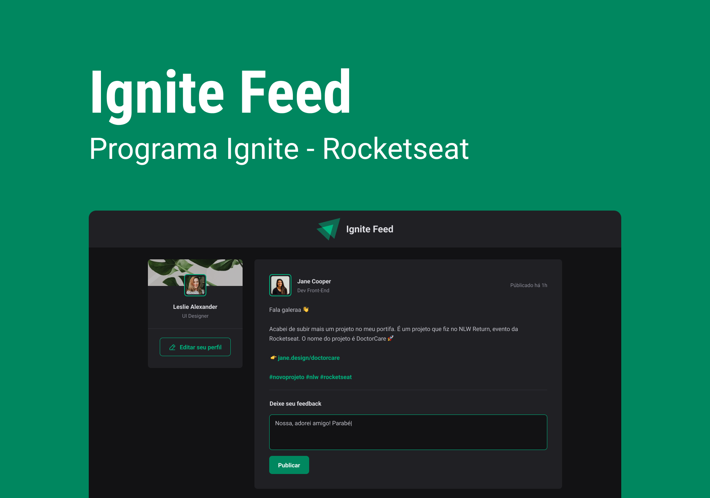

<h1 align="center">
  Projeto Ignite Feed Com React
</h1>

  <a href="https://feed-ignite-dun.vercel.app/">🔗 Live Preview</a>&nbsp;&nbsp;&nbsp;|&nbsp;&nbsp;&nbsp;
  <a href="#-projeto">🖥️ Projeto</a>&nbsp;&nbsp;&nbsp;|&nbsp;&nbsp;&nbsp;
  <a href="#-tecnologias">🚀 Tecnologias</a>&nbsp;&nbsp;&nbsp;|&nbsp;&nbsp;&nbsp;

## 💻 Projeto

O **Projeto Ignite Feed** da Rocketseat é uma especialização em React que tem como objetivo desenvolver um feed de redes sociais com diversas funcionalidades utilizando React, seguindo as melhores práticas de programação e a estruturação do projeto de forma organizada e limpa.

Neste projeto, foram desenvolvidas **funcionalidades para curtir, comentar e excluir comentários**, tornando a experiência do usuário mais dinâmica e interativa. Todo o código foi pensado e implementado seguindo os princípios do clean code, a fim de tornar o código mais legível, eficiente e fácil de manter.

O Projeto Ignite Feed da Rocketseat foi uma excelente oportunidade para desenvolvedor e aprimorarem minhas habilidades em React, trabalhando em um projeto real e aprendendo na prática como implementar funcionalidades importantes em um sistema de rede social.

## 🚀 Tecnologias

Esse projeto foi desenvolvido com as seguintes tecnologias:

- React
- JavaScript
- Typescript

